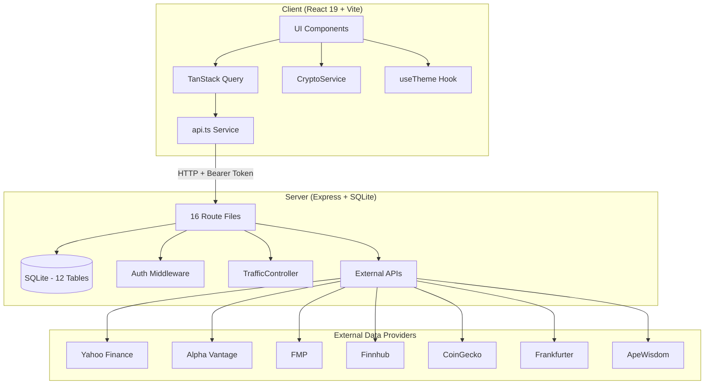
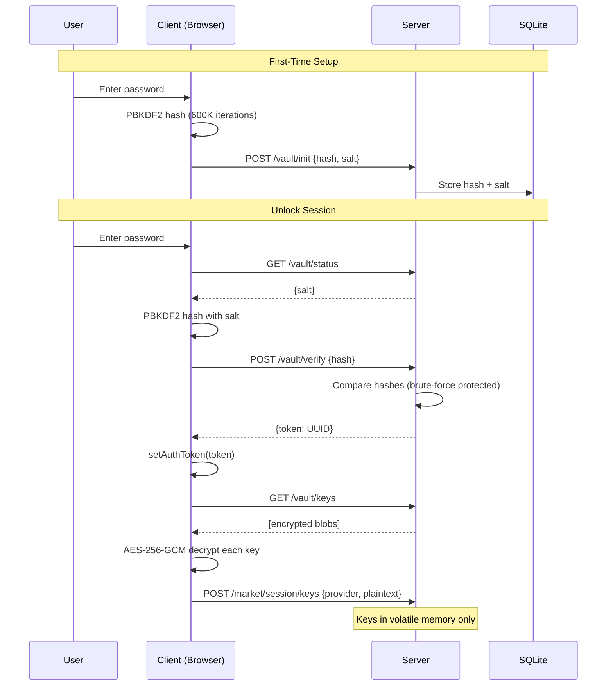
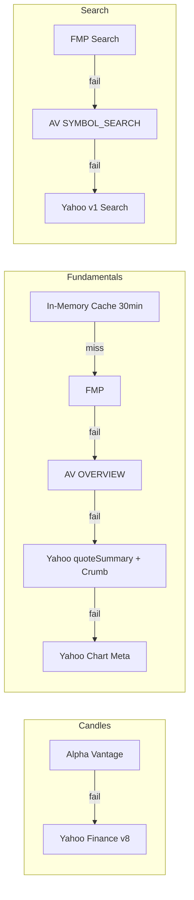
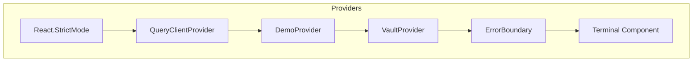
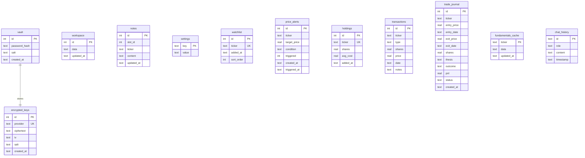

# Orbit Terminal — Codebase Knowledge Document

> **Purpose**: Comprehensive, self-contained reference for any LLM or developer to implement features, fix bugs, and refactor safely — without additional codebase exploration.

---

## 📋 Table of Contents

- [1. High-Level Overview](#1-high-level-overview)
- [2. Architecture](#2-architecture)
- [3. Database Schema](#3-database-schema)
- [4. API Endpoint Reference](#4-api-endpoint-reference)
- [5. Feature-by-Feature Analysis](#5-feature-by-feature-analysis)
- [6. Nuances, Gotchas & Things You Must Know](#6-nuances-gotchas--things-you-must-know)
- [7. Glossary](#7-glossary)
- [8. Test Coverage](#8-test-coverage)
- [9. Dependency Map](#9-dependency-map)

---

## 1. High-Level Overview

### What It Is

Orbit Terminal is a **local-first, privacy-focused financial dashboard** for real-time market analysis. It runs entirely on the user's machine — an Express server with SQLite for persistence and a React SPA for the UI. API keys are encrypted client-side with AES-256-GCM before storage; the server never sees plaintext keys. All external data providers are free-tier compatible.

### Target Users

Individual traders, retail investors, and financial analysts who want a self-hosted terminal without subscription fees or data leaving their machine.

### Tech Stack Summary

| Layer | Technology | Purpose |
|-------|-----------|---------|
| Frontend | React 19, Vite, Tailwind CSS v4, shadcn/ui (17 primitives) | SPA with dark terminal aesthetic |
| State | TanStack Query | Server state, caching, background refetch |
| Charts | `lightweight-charts` (TradingView) | Candlestick & line charts |
| Indicators | `trading-signals` | Client-side SMA, EMA, RSI, MACD, Bollinger Bands |
| Command Palette | `cmdk` | ⌘K search and navigation |
| Shortcuts | `react-hotkeys-hook` | Keyboard shortcuts |
| Backend | Express (Node.js ESM) | HTTP API server |
| Database | `better-sqlite3` (WAL mode, 12 tables) | Local persistence |
| Shared | TypeScript types package (`@orbit/shared`) | Shared interfaces across client & server |
| Tooling | npm workspaces, Vitest (69 tests), `mise` | Monorepo, testing, Node version pinning |

### Monorepo Structure (3 packages)

```
orbit-terminal/
├── package.json                  # Root — npm workspaces, concurrently
├── packages/
│   ├── shared/                   # @orbit/shared — TypeScript interfaces only
│   │   └── src/index.ts          # ~260 LOC, all type exports
│   ├── server/                   # @orbit/server — Express + SQLite
│   │   └── src/
│   │       ├── index.ts          # App bootstrap, route mounting, CORS
│   │       ├── db/database.ts    # SQLite init, schema (12 tables), WAL mode
│   │       ├── middleware/auth.ts # Bearer token auth (single session slot)
│   │       ├── services/TrafficController.ts  # Token-bucket rate limiter
│   │       └── routes/           # 16 route files
│   └── client/                   # @orbit/client — React 19 SPA
│       └── src/
│           ├── main.tsx          # ReactDOM root, QueryClientProvider
│           ├── App.tsx           # Terminal component, ErrorBoundary, routing
│           ├── services/
│           │   ├── api.ts        # HTTP client (all endpoints)
│           │   └── CryptoService.ts  # Web Crypto API encryption
│           ├── hooks/useTheme.ts # Dark/light toggle with localStorage
│           ├── utils/market.ts   # NYSE open/closed status
│           └── components/
│               ├── ui/           # 17 shadcn/ui primitives
│               ├── shared/       # TickerAutocomplete (reusable)
│               ├── SecuritySlot/ # Chart slot (PriceChart, RatioSidebar, etc.)
│               ├── Vault/        # VaultProvider, VaultSetup, VaultUnlock, ApiKeyManager
│               ├── Demo/         # DemoProvider
│               ├── Watchlist/    # WatchlistPanel (Sheet)
│               ├── Alerts/       # AlertsPanel (Sheet)
│               ├── Portfolio/    # PortfolioView (Holdings + Transactions tabs)
│               ├── Journal/      # TradeJournal
│               ├── Earnings/     # EarningsCalendar
│               ├── DataExplorer/ # Crypto, Forex, Economic, Sentiment, Insider, Correlation
│               ├── Screener/     # ScreenerView
│               ├── AIChat/       # AIChatPanel (Groq / Ollama)
│               └── Export/       # ExportButton (CSV/PDF)
```

---

## 2. Architecture

### System Architecture



### Authentication Flow



### Data Provider Fallback Chain



### Provider Hierarchy (React Component Tree)



**Key files:**
- `packages/client/src/main.tsx` — `React.StrictMode` → `QueryClientProvider`
- `packages/client/src/App.tsx` — `DemoProvider` → `VaultProvider` → `ErrorBoundary` → `Terminal`
- `packages/server/src/index.ts` — Express app, route mounting, CORS origin `http://localhost:5173`
- `packages/server/src/middleware/auth.ts` — Single `sessionToken` variable (module-level singleton)


---

## 3. Database Schema

**File:** `packages/server/src/db/database.ts`
**Location:** `packages/server/orbit.db` (auto-created on first run)
**Engine:** `better-sqlite3` with WAL journal mode and foreign keys enabled.



### Table Details

| Table | Rows | Key Constraints | Notes |
|-------|------|----------------|-------|
| `vault` | Singleton (`id = 1`) | `CHECK (id = 1)` | Only one vault per instance |
| `encrypted_keys` | One per provider | `UNIQUE(provider)` | Upsert on conflict |
| `workspace` | Singleton (`id = 1`) | `CHECK (id = 1)` | `data` is JSON string of `Workspace` |
| `notes` | Per slot+ticker | `UNIQUE(slot_id, ticker)` | Markdown content |
| `settings` | Key-value pairs | PK on `key` | Used for `demo_seeded` flag |
| `watchlist` | Per ticker | `UNIQUE(ticker)` | `sort_order` for drag-drop |
| `price_alerts` | Multiple per ticker | `condition IN ('above','below')` | `triggered` is 0/1 integer |
| `holdings` | Per ticker | `UNIQUE(ticker)` | Weighted avg cost on upsert |
| `transactions` | Append-only log | `type IN ('buy','sell')` | Linked to holdings via ticker |
| `trade_journal` | Per trade | `status IN ('open','closed')` | P&L auto-calculated on close |
| `fundamentals_cache` | Per ticker | PK on `ticker` | Server-side SQLite cache (separate from in-memory) |
| `chat_history` | Per message | PK on UUID `id` | `role IN ('user','assistant')` |


---

## 4. API Endpoint Reference

**Base URL:** `http://localhost:3001/api`
**Auth:** Bearer token in `Authorization` header. Token obtained from `POST /vault/verify` or `POST /demo/seed`.
**Response format:** All responses follow `{ success: boolean, data?: T, error?: string }` (`ApiResponse<T>` from `@orbit/shared`).

### Route Mounting (from `packages/server/src/index.ts`)

Unprotected routes (no `requireAuth` middleware):
- `/api/vault/*` — All vault operations
- `/api/demo/*` — Demo seed/clear
- `/api/health` — Health check

All other routes use `requireAuth` middleware.

### Complete Endpoint Table

| Method | Path | Auth | Route File | Purpose |
|--------|------|:----:|-----------|---------|
| GET | `/api/health` | No | `index.ts` | Health check + `bootId` (used for server-restart detection) |
| POST | `/api/vault/init` | No | `routes/vault.ts` | Initialize vault with password hash + salt |
| GET | `/api/vault/status` | No | `routes/vault.ts` | Check if vault exists, return salt |
| POST | `/api/vault/verify` | No | `routes/vault.ts` | Verify password hash, return session token (UUID) |
| POST | `/api/vault/keys` | No | `routes/vault.ts` | Store encrypted API key blob |
| GET | `/api/vault/keys` | No | `routes/vault.ts` | Get all encrypted key blobs |
| DELETE | `/api/vault/keys/:provider` | No | `routes/vault.ts` | Delete encrypted key for provider |
| POST | `/api/vault/reset` | No | `routes/vault.ts` | **DESTRUCTIVE** — Wipe vault, keys, notes, workspace, settings |
| POST | `/api/demo/seed` | No | `routes/demo.ts` | Seed demo data + return session token |
| POST | `/api/demo/clear` | No | `routes/demo.ts` | Clear all demo data |
| GET | `/api/workspace` | Yes | `routes/workspace.ts` | Get workspace state (JSON) |
| PUT | `/api/workspace` | Yes | `routes/workspace.ts` | Save workspace state |
| GET | `/api/workspace/export` | Yes | `routes/workspace.ts` | Export workspace + notes + settings as `WorkspaceExport` |
| POST | `/api/workspace/import` | Yes | `routes/workspace.ts` | Import `WorkspaceExport` (version 1 only) |
| GET | `/api/notes/:slotId/:ticker` | Yes | `routes/notes.ts` | Get note for slot+ticker |
| PUT | `/api/notes` | Yes | `routes/notes.ts` | Upsert note (body: `{slotId, ticker, content}`) |
| GET | `/api/notes` | Yes | `routes/notes.ts` | List all notes |
| POST | `/api/market/session/keys` | Yes | `routes/market.ts` | Set decrypted API key in volatile memory |
| POST | `/api/market/session/lock` | Yes | `routes/market.ts` | Clear all in-memory API keys |
| GET | `/api/market/session/check` | Yes | `routes/market.ts` | Check which providers have active keys |
| GET | `/api/market/candles/:ticker` | Yes | `routes/market.ts` | OHLCV candles (AV → Yahoo fallback) |
| GET | `/api/market/fundamentals/:ticker` | Yes | `routes/market.ts` | Fundamental ratios (Cache → FMP → AV → Yahoo → Yahoo chart meta) |
| GET | `/api/market/search?q=` | Yes | `routes/market.ts` | Ticker search (FMP → AV → Yahoo) |
| GET | `/api/market/rate-status` | Yes | `routes/market.ts` | TrafficController token bucket status |
| GET | `/api/watchlist` | Yes | `routes/watchlist.ts` | Get all watchlist items (ordered by `sort_order`) |
| POST | `/api/watchlist` | Yes | `routes/watchlist.ts` | Add ticker to watchlist |
| DELETE | `/api/watchlist/:ticker` | Yes | `routes/watchlist.ts` | Remove ticker from watchlist |
| PUT | `/api/watchlist/reorder` | Yes | `routes/watchlist.ts` | Reorder watchlist (body: `{tickers: string[]}`) |
| GET | `/api/alerts` | Yes | `routes/alerts.ts` | Get all price alerts |
| POST | `/api/alerts` | Yes | `routes/alerts.ts` | Create alert (body: `{ticker, targetPrice, condition}`) |
| DELETE | `/api/alerts/:id` | Yes | `routes/alerts.ts` | Delete alert |
| PUT | `/api/alerts/:id/trigger` | Yes | `routes/alerts.ts` | Mark alert as triggered |
| GET | `/api/news/:ticker` | Yes | `routes/news.ts` | Per-ticker news (Finnhub → Yahoo fallback) |
| GET | `/api/portfolio/holdings` | Yes | `routes/portfolio.ts` | Get all holdings |
| POST | `/api/portfolio/holdings` | Yes | `routes/portfolio.ts` | Add/update holding (weighted avg cost on conflict) |
| DELETE | `/api/portfolio/holdings/:ticker` | Yes | `routes/portfolio.ts` | Remove holding |
| GET | `/api/portfolio/transactions` | Yes | `routes/portfolio.ts` | Get all transactions (DESC by date) |
| POST | `/api/portfolio/transactions` | Yes | `routes/portfolio.ts` | Add transaction + auto-update holdings |
| DELETE | `/api/portfolio/transactions/:id` | Yes | `routes/portfolio.ts` | Delete transaction |
| GET | `/api/earnings` | Yes | `routes/earnings.ts` | Upcoming earnings (next 7 days, Finnhub) |
| GET | `/api/earnings/:ticker` | Yes | `routes/earnings.ts` | Ticker-specific earnings (Finnhub) |
| GET | `/api/journal` | Yes | `routes/journal.ts` | Get all journal entries (DESC by created_at) |
| POST | `/api/journal` | Yes | `routes/journal.ts` | Create trade entry |
| PUT | `/api/journal/:id/close` | Yes | `routes/journal.ts` | Close trade (auto-calculates P&L) |
| DELETE | `/api/journal/:id` | Yes | `routes/journal.ts` | Delete journal entry |
| GET | `/api/crypto` | Yes | `routes/crypto.ts` | Top 50 cryptos by market cap (CoinGecko) |
| GET | `/api/crypto/:id` | Yes | `routes/crypto.ts` | Single crypto details (CoinGecko) |
| GET | `/api/crypto/:id/chart?days=` | Yes | `routes/crypto.ts` | Crypto price history (CoinGecko) |
| GET | `/api/forex/latest?base=` | Yes | `routes/forex.ts` | Latest forex rates (Frankfurter) |
| GET | `/api/forex/history?base=&quote=&days=` | Yes | `routes/forex.ts` | Historical forex rates (Frankfurter) |
| GET | `/api/insider/:ticker` | Yes | `routes/insider.ts` | Insider transactions (Finnhub) |
| GET | `/api/economic` | Yes | `routes/economic.ts` | Economic calendar (Finnhub) |
| GET | `/api/sentiment` | Yes | `routes/sentiment.ts` | Reddit trending stocks (ApeWisdom) |
| GET | `/api/sentiment/:ticker` | Yes | `routes/sentiment.ts` | Ticker-specific sentiment (ApeWisdom) |


---

## 5. Feature-by-Feature Analysis

### Feature 1: Secure Vault (Encryption & Key Management)

**Purpose:** Zero-knowledge encrypted storage for API keys. The server never sees plaintext keys.

**Technical Implementation:**
- **Client-side encryption:** `packages/client/src/services/CryptoService.ts`
  - `hashPassword(password, salt?)` — PBKDF2 with 600K iterations, SHA-256, returns base64 hash + salt
  - `encrypt(plaintext, password)` — AES-256-GCM with random 16-byte salt and 12-byte IV
  - `decrypt(blob, password)` — Reverses encryption using stored salt/IV
- **VaultProvider:** `packages/client/src/components/Vault/VaultProvider.tsx`
  - React context managing vault state: `loading | uninitialized | locked | unlocked`
  - On unlock: fetches encrypted blobs → decrypts each → sends plaintext to server session via `POST /market/session/keys`
  - Polls `/api/health` every 30s; if `bootId` changes (server restart), re-syncs keys
  - Holds master password in React state (`useState`) for re-encryption operations
- **Server-side:** `packages/server/src/routes/vault.ts`
  - Brute-force protection: 5 attempts → 30s lockout (in-memory `failedAttempts` / `lockoutUntil`)
  - `POST /vault/reset` wipes vault, encrypted_keys, notes, workspace, settings — **no auth required**
- **UI Components:**
  - `VaultSetup.tsx` — First-time password creation + "Try Demo" button
  - `VaultUnlock.tsx` — Password entry for returning users
  - `ApiKeyManager.tsx` — Add/remove API keys per provider

**DB Tables:** `vault`, `encrypted_keys`

**Cross-feature interactions:**
- Demo mode calls `generateSessionToken()` which **overwrites** the existing vault session token
- Locking vault calls `POST /market/session/lock` to clear in-memory keys on server

---

### Feature 2: Workspace System (4 Slots, Layouts, Persistence, Drag-Drop)

**Purpose:** 2×2 resizable grid where each slot independently displays a ticker's chart, indicators, news, and thesis.

**Technical Implementation:**
- **State:** `Workspace` type from `@orbit/shared` — `{ slots: SlotState[4], layout: 'grid' | 'spotlight', updatedAt }`
- **Persistence:** Auto-saves to server 1 second after any change (debounced `useEffect` in `App.tsx`)
- **Layouts:**
  - `grid` — `ResizableGrid` component with draggable dividers
  - `spotlight` — First slot takes full height, others collapsed
- **Drag-drop rearrangement:** HTML5 drag events in `App.tsx` (`dragSlot`/`overSlot` state) swap slot contents
- **Export/Import:** `GET /workspace/export` returns `WorkspaceExport` (version 1) with workspace + notes + settings; `POST /workspace/import` validates and restores

**Key Files:**
- `packages/client/src/App.tsx` — `Terminal` component, workspace state, `updateSlot()`, `handleSlotDrop()`
- `packages/client/src/components/ResizableGrid.tsx` — CSS Grid with `calc()` for divider math, mouse event handlers for resize
- `packages/server/src/routes/workspace.ts` — CRUD + export/import

**DB Tables:** `workspace` (singleton row, JSON blob), `notes`, `settings`

---

### Feature 3: Charts & Technical Indicators

**Purpose:** Interactive candlestick/line charts with toggleable technical indicators.

**Technical Implementation:**
- **PriceChart:** `packages/client/src/components/SecuritySlot/PriceChart.tsx`
  - Uses `lightweight-charts` (`createChart`, `addCandlestickSeries`, `addLineSeries`)
  - `ResizeObserver` for responsive sizing
  - **Deduplicates candle data** — `new Map(data.map(d => [d.time, d]))` because Yahoo returns duplicates
  - Theme-aware colors (reads `document.documentElement.classList` for light/dark)
  - Displays latest price + daily change % overlay
- **IndicatorOverlay:** `packages/client/src/components/SecuritySlot/IndicatorOverlay.tsx`
  - `computeIndicators()` — Pure function using `trading-signals` library
  - Supported: `sma20`, `ema12`, `ema26`, `rsi` (14), `macd` (12/26/9), `bb` (20/2)
  - Renders as `Badge` components below the chart
  - RSI color-coded: >70 red, <30 green
- **IndicatorSelector:** `packages/client/src/components/SecuritySlot/IndicatorSelector.tsx` — Toggle buttons
- **Time ranges:** `1W | 1M | 3M | 6M | 1Y | 5Y` — mapped to Yahoo Finance range params in `routes/market.ts`

**Data flow:** `SecuritySlot` → TanStack Query (`['candles', ticker, timeRange]`) → `api.market.getCandles()` → server → AV/Yahoo

---

### Feature 4: Fundamental Analysis (Multi-Provider, Crumb Auth)

**Purpose:** Display key financial ratios (P/E, PEG, D/E, ROE, EPS, Beta, Market Cap, etc.) with multi-provider fallback.

**Technical Implementation:**
- **Server:** `packages/server/src/routes/market.ts` — `GET /fundamentals/:ticker`
  - **Tier 1:** In-memory cache (`Map<string, {data, expiry}>`, 30-min TTL)
  - **Tier 2:** FMP (`/v3/profile` + `/v3/ratios-ttm` in parallel)
  - **Tier 3:** Alpha Vantage `OVERVIEW` function (skips rate limiter)
  - **Tier 4:** Yahoo Finance `quoteSummary` with crumb-based auth
  - **Tier 5:** Yahoo Finance chart meta (company name only, all ratios null)
- **Yahoo Crumb:** `getYahooCrumb()` in `routes/market.ts`
  - Fetches cookie from `fc.yahoo.com` → uses cookie to get crumb from `query2.finance.yahoo.com/v1/test/getcrumb`
  - Cached for 1 hour (`CRUMB_TTL = 60 * 60 * 1000`)
  - No retry on stale crumb — just falls through to chart meta
- **Client:** `packages/client/src/components/SecuritySlot/RatioSidebar.tsx`
  - Displays `FundamentalRatios` with color-coded values (`getRatioColor()`)
  - 140px fixed-width sidebar in each slot

**DB Tables:** `fundamentals_cache` (SQLite, separate from in-memory `Map`)

---

### Feature 5: Command Palette & Keyboard Shortcuts

**Purpose:** ⌘K-powered command palette for ticker search, navigation, and quick actions.

**Technical Implementation:**
- **CommandPalette:** `packages/client/src/components/CommandPalette.tsx`
  - Uses `cmdk` library (`CommandDialog`, `CommandInput`, `CommandList`, etc.)
  - Three groups: Search Tickers (live API search), Navigation (7 views), Actions (6 actions)
  - `shouldFilter={false}` — filtering handled by API search, not cmdk
  - Search triggers TanStack Query `['tickerSearch', search]` with 30s stale time
- **Keyboard shortcuts** (registered in `App.tsx` via `react-hotkeys-hook`):
  - `⌘K` — Open command palette
  - `⌘W` — Toggle watchlist panel
  - `⌘A` — Toggle alerts panel
  - `⌘Z` — Toggle zen mode
  - `⌘⌥1-4` — Focus slot 1-4 input
  - `Escape` — Close all panels
- **Shortcuts dialog:** Opened via command palette → "Show Keyboard Shortcuts" action

**Key Files:**
- `packages/client/src/components/CommandPalette.tsx`
- `packages/client/src/App.tsx` (lines with `useHotkeys`)

---

### Feature 6: Watchlist (CRUD, Sparklines, Drag-Drop Reorder)

**Purpose:** Track favorite tickers with live prices, daily change %, and SVG sparklines.

**Technical Implementation:**
- **WatchlistPanel:** `packages/client/src/components/Watchlist/WatchlistPanel.tsx`
  - Rendered as a `Sheet` (slide-out panel from right)
  - Each `WatchlistRow` fetches its own candle data via TanStack Query (`['candles', ticker, '1M']`)
  - `Sparkline` component — Pure SVG `<polyline>` from last 20 close prices, green/red based on direction
  - Drag-drop reorder via HTML5 drag events → `PUT /watchlist/reorder` with new ticker order
  - "Clear all" button removes all items (sequential `DELETE` calls)
  - Bookmark button in each `SecuritySlot` header adds current ticker
- **Server:** `packages/server/src/routes/watchlist.ts`
  - `sort_order` column for ordering; auto-incremented on add
  - `UNIQUE(ticker)` prevents duplicates (returns 409)

**DB Tables:** `watchlist`

---

### Feature 7: Price Alerts

**Purpose:** Set above/below price thresholds per ticker with visual notification when triggered.

**Technical Implementation:**
- **AlertsPanel:** `packages/client/src/components/Alerts/AlertsPanel.tsx`
  - Rendered as a `Sheet` (slide-out panel)
  - Create form: ticker (with `TickerAutocomplete`), target price, condition (above/below)
  - Displays all alerts with triggered status
  - Delete button per alert
- **Server:** `packages/server/src/routes/alerts.ts`
  - CRUD operations on `price_alerts` table
  - `PUT /:id/trigger` sets `triggered = 1` and `triggered_at = datetime('now')`
  - `condition` validated as `'above' | 'below'`

**DB Tables:** `price_alerts`


---

### Feature 8: News Feed (Finnhub + Yahoo Fallback)

**Purpose:** Per-ticker news articles displayed inline in each slot.

**Technical Implementation:**
- **NewsFeed:** `packages/client/src/components/SecuritySlot/NewsFeed.tsx`
  - Toggled via CHART/NEWS tab buttons in `SecuritySlot` header
  - `timeAgo()` helper for relative timestamps
  - Links open in new tab
- **Server:** `packages/server/src/routes/news.ts`
  - **Primary:** Finnhub `/v1/company-news` (last 7 days, max 15 articles, requires `finnhub` key)
  - **Fallback:** Yahoo Finance `/v1/finance/search` with `newsCount=15` (no key needed)
  - Returns empty array on all failures (graceful degradation)
  - Uses `getApiKey('finnhub')` imported from `routes/market.ts`

**DB Tables:** None (stateless)

---

### Feature 9: Portfolio Tracker (Holdings, Transactions, P&L)

**Purpose:** Track holdings with live P&L calculation, transaction log with weighted average cost basis.

**Technical Implementation:**
- **PortfolioView:** `packages/client/src/components/Portfolio/PortfolioView.tsx`
  - Two tabs: `HoldingsTab` and `TransactionsTab`
  - `HoldingsTab` — Displays ticker, shares, avg cost, add/remove buttons with `TickerAutocomplete`
  - `TransactionsTab` — Log of buy/sell transactions with date, price, notes
  - Summary cards for total value, gain/loss (requires live price data from fundamentals)
- **Server:** `packages/server/src/routes/portfolio.ts`
  - `POST /holdings` — Upsert with weighted average cost: `avg_cost = (old_avg * old_shares + new_avg * new_shares) / total_shares`
  - `POST /transactions` — Wraps in SQLite transaction: inserts transaction + updates holdings (buy adds shares, sell subtracts)
  - Transaction deletion does NOT reverse the holdings change (potential data inconsistency)

**DB Tables:** `holdings`, `transactions`

---

### Feature 10: Trade Journal (Open/Closed Trades, Auto P&L)

**Purpose:** Track trades with entry/exit prices, thesis, outcome notes, and automatic P&L calculation.

**Technical Implementation:**
- **TradeJournal:** `packages/client/src/components/Journal/TradeJournal.tsx`
  - `TradesTable` — Displays open and closed trades
  - Create form: ticker (autocomplete), entry price, entry date, shares, thesis (with markdown help link)
  - Close trade form: exit price, exit date, outcome notes
  - Color-coded P&L display (`pnlColor()` helper)
- **Server:** `packages/server/src/routes/journal.ts`
  - `PUT /:id/close` — Auto-calculates P&L: `(exitPrice - entryPrice) * shares`
  - Status transitions: `open` → `closed` (one-way)

**DB Tables:** `trade_journal`

---

### Feature 11: Earnings Calendar

**Purpose:** Display upcoming earnings dates with timing badges (Before Open / After Close).

**Technical Implementation:**
- **EarningsCalendar:** `packages/client/src/components/Earnings/EarningsCalendar.tsx`
  - Fetches via `api.earnings.upcoming()`
  - Displays ticker, date, EPS estimate/actual, revenue estimate/actual, hour badge
- **Server:** `packages/server/src/routes/earnings.ts`
  - Finnhub `/v1/calendar/earnings` — next 7 days
  - `mapEarnings()` helper normalizes Finnhub response to `EarningsEvent[]`
  - Returns empty array if no Finnhub key (graceful degradation)
  - `hour` field: `'bmo'` (before market open), `'amc'` (after market close), `'dmh'` (during market hours), `''`

**DB Tables:** None (stateless)

---

### Feature 12: Data Explorer (Crypto, Forex, Economic, Sentiment)

**Purpose:** Tabbed interface with five data sources for market exploration.

**Technical Implementation:**
- **DataExplorer:** `packages/client/src/components/DataExplorer/DataExplorer.tsx`
  - Tabs: Crypto, Forex, Economic, Sentiment (Insider and Correlation are separate views)
- **CryptoView:** `packages/client/src/components/DataExplorer/CryptoView.tsx`
  - Top 50 by market cap from CoinGecko (no key required)
  - Search filter, `fmtLarge()` for market cap formatting
  - Server: `packages/server/src/routes/crypto.ts` — 3 endpoints (list, detail, chart)
- **ForexView:** `packages/client/src/components/DataExplorer/ForexView.tsx`
  - Exchange rates from Frankfurter API (no key required, unlimited)
  - 2-currency converter with base/quote selection
  - Server: `packages/server/src/routes/forex.ts` — latest rates + historical
- **InsiderView:** `packages/client/src/components/DataExplorer/InsiderView.tsx`
  - Per-ticker insider transactions from Finnhub (requires key)
  - Server: `packages/server/src/routes/insider.ts`
- **EconomicView:** `packages/client/src/components/DataExplorer/EconomicView.tsx`
  - Upcoming economic events with impact ratings (low/medium/high) from Finnhub
  - Server: `packages/server/src/routes/economic.ts`
- **SentimentView:** `packages/client/src/components/DataExplorer/SentimentView.tsx`
  - Reddit trending stocks from ApeWisdom (no key required)
  - Search filter, mentions + upvotes display
  - Server: `packages/server/src/routes/sentiment.ts` — `fetchSentiment()` helper

**DB Tables:** None (all stateless)

---

### Feature 13: Stock Screener

**Purpose:** Filter stocks by fundamental criteria with a dynamic filter builder.

**Technical Implementation:**
- **ScreenerView:** `packages/client/src/components/Screener/ScreenerView.tsx`
  - Dynamic filter builder: add field (P/E, ROE, D/E, Market Cap, etc.) + operator (gt/lt/eq/gte/lte) + value
  - `passesFilter()` — Pure function that checks a `FundamentalRatios` object against `ScreenerFilter[]`
  - Fetches fundamentals for each ticker in the user's watchlist/portfolio, then filters client-side
  - Uses `TickerAutocomplete` for adding tickers to screen

**Key types:** `ScreenerFilter`, `ScreenerResult` from `@orbit/shared`

**DB Tables:** None (client-side filtering of fetched data)

---

### Feature 14: Correlation Matrix

**Purpose:** Pearson correlation between 2–6 tickers with a color-coded table.

**Technical Implementation:**
- **CorrelationView:** `packages/client/src/components/DataExplorer/CorrelationView.tsx`
  - `dailyReturns(candles)` — Computes daily return percentages from close prices
  - `pearsonCorrelation(x, y)` — Standard Pearson r calculation
  - `corrColor(r)` — Maps correlation value to color (green for positive, red for negative)
  - Ticker input via `TickerAutocomplete` chips (2–6 tickers)
  - Fetches candle data for each ticker, computes pairwise correlations

**DB Tables:** None (client-side computation)


---

### Feature 15: CSV/PDF Export

**Purpose:** Export portfolio holdings, trade journal, and watchlist as CSV or styled PDF.

**Technical Implementation:**
- **ExportButton:** `packages/client/src/components/Export/ExportButton.tsx`
  - `Select` dropdown with 4 options: Portfolio CSV, Portfolio PDF, Journal CSV, Watchlist CSV
  - `toCsv(headers, rows)` — Builds CSV string with quoted fields
  - `downloadFile(content, filename, mime)` — Creates Blob → object URL → triggers download
  - PDF via `jsPDF` + `jspdf-autotable` — styled table with gold header (`fillColor: [240, 185, 11]`)
- **Workspace JSON export/import** is separate (handled in `App.tsx` via `handleExport`/`handleImport`)

**DB Tables:** Reads from `holdings`, `trade_journal`, `watchlist`

---

### Feature 16: Zen Mode

**Purpose:** Full-screen single chart with all UI chrome hidden.

**Technical Implementation:**
- Toggled via `⌘Z` or command palette → "Toggle Zen Mode"
- In `App.tsx`: when `zenMode === true`, renders only `SecuritySlot` for `slots[0]` with `isSpotlight={true}`
- Exit button fixed at bottom-right: `"Exit Zen (⌘Z)"`
- `Escape` key also exits zen mode

**Key state:** `zenMode` boolean in `Terminal` component

---

### Feature 17: Demo Mode

**Purpose:** Pre-populated experience without API keys for first-time users.

**Technical Implementation:**
- **DemoProvider:** `packages/client/src/components/Demo/DemoProvider.tsx`
  - Persists demo state in `localStorage` (`orbit-demo-mode`, `orbit-demo-token`)
  - `enableDemo()` — Calls `POST /demo/seed`, stores token, reloads page
  - `exitDemo()` — Clears localStorage, calls `POST /demo/clear`, reloads page
  - On mount in demo mode: restores token from localStorage + re-seeds (handles server restart)
- **Server:** `packages/server/src/routes/demo.ts`
  - `POST /seed` — Calls `generateSessionToken()` (overwrites any existing vault session), then seeds:
    - 8 watchlist tickers, 4-slot workspace (AAPL, MSFT, GOOGL, TSLA)
    - 5 portfolio holdings, 8 transactions, 4 journal entries, 5 price alerts, 4 slot notes
    - Sets `demo_seeded = 'true'` in settings (idempotent — skips if already seeded)
  - `POST /clear` — Deletes watchlist, holdings, transactions, journal, alerts, notes, workspace, demo flag

**Critical gotcha:** `generateSessionToken()` in demo seed **replaces** the module-level `sessionToken` in `auth.ts`, invalidating any existing vault session.

---

### Feature 18: Dark/Light Theme

**Purpose:** Toggle between dark terminal aesthetic and light mode with persistence.

**Technical Implementation:**
- **useTheme:** `packages/client/src/hooks/useTheme.ts`
  - Reads initial theme from `localStorage` key `orbit-theme` (default: `'dark'`)
  - Toggles `dark`/`light` class on `document.documentElement`
  - `toggleTheme()` callback exposed to UI
- **PriceChart** reads theme from DOM: `document.documentElement.classList.contains('light')` to set chart colors
- Tailwind CSS v4 handles all component theming via CSS variables

---

### Feature 19: Ticker Autocomplete

**Purpose:** Unified autocomplete component used across all ticker input fields.

**Technical Implementation:**
- **TickerAutocomplete:** `packages/client/src/components/shared/TickerAutocomplete.tsx`
  - Debounced search (300ms) via `api.market.search()`
  - Keyboard navigation: ArrowUp/Down, Enter to select, Escape to close
  - Enter on empty results submits raw input as uppercase ticker
  - Click-outside detection via `mousedown` event listener
  - ARIA attributes: `role="combobox"`, `aria-expanded`, `aria-autocomplete="list"`, `role="option"`, `aria-selected`
- **Used in:** AlertsPanel, PortfolioView, TradeJournal, ScreenerView, CorrelationView, WatchlistPanel (manual input, not autocomplete)

---

### Feature 20: Resizable Grid

**Purpose:** 2×2 grid with draggable dividers for custom slot sizing.

**Technical Implementation:**
- **ResizableGrid:** `packages/client/src/components/ResizableGrid.tsx`
  - CSS Grid with 3 columns × 3 rows (content + 4px dividers)
  - `colPct` and `rowPct` state (default 50%) — clamped to 15%–85%
  - `startDrag(axis, event)` — Attaches `mousemove`/`mouseup` listeners to `document`
  - Column template: `calc(${colPct}% - 2px) 4px calc(${100 - colPct}% - 2px)`
  - Center cell (intersection of dividers) allows simultaneous col+row resize
  - Sets `document.body.style.cursor` and `userSelect` during drag for UX

**CSS requirement:** Child slots need `h-full min-h-0` for grid resize to work correctly (overflow hidden).

### Feature 20b: AI Chat (⌘I)

**Purpose:** BYOK LLM chat for financial analysis. Supports Groq (cloud) or Ollama (local).

**Technical Implementation:**
- **AIChatPanel:** `packages/client/src/components/AIChat/AIChatPanel.tsx`
  - Rendered as a `Sheet` (slide-out panel)
  - Provider selector: Groq or Ollama
  - `sendToGroq(messages, apiKey)` — Calls `https://api.groq.com/openai/v1/chat/completions` with model `llama-3.1-8b-instant`
  - `sendToOllama(messages)` — Calls `http://localhost:11434/api/chat` with model `llama3.1`, `stream: false`
  - System prompt: "You are a financial analyst assistant..."
  - Messages stored in component state (not persisted to DB despite `chat_history` table existing)
  - Groq API key retrieved from vault via `vault.getApiKey('groq')`

**DB Tables:** `chat_history` (schema exists but not currently used by the component)


---

## 6. Nuances, Gotchas & Things You Must Know

### Security & Auth

1. **Session token is single-slot.** `auth.ts` stores one `sessionToken` in a module-level variable. Only one session can be active at a time. Calling `generateSessionToken()` (from vault verify OR demo seed) overwrites the previous token, invalidating any other active session.

2. **Vault routes are UNPROTECTED.** All `/api/vault/*` endpoints (including `/vault/reset` which wipes the database) have no `requireAuth` middleware. This is by design (vault must be accessible before auth), but `/vault/reset` is destructive and unauthenticated.

3. **Brute-force state resets on server restart.** `failedAttempts` and `lockoutUntil` in `vault.ts` are in-memory variables. Restarting the server resets the lockout counter.

4. **Demo mode invalidates existing vault sessions.** `POST /demo/seed` calls `generateSessionToken()`, replacing the current session token. A user with an active vault session will be silently logged out.

### Data Providers

5. **Yahoo crumb cached 1 hour, no retry on stale.** If the crumb expires mid-request, the fundamentals endpoint falls through to chart meta (company name only, all ratios null) rather than refreshing the crumb and retrying.

6. **TrafficController only rate-limits AV candles, not AV OVERVIEW.** The `alphaVantageController.acquire()` call is only in the candles endpoint. The fundamentals endpoint calls AV OVERVIEW without rate limiting (comment in code: "Skip rate limiter — OVERVIEW is independent from TIME_SERIES calls").

7. **Fundamentals cache is unbounded in-memory.** The `fundamentalsCache` Map in `routes/market.ts` grows without limit. Each ticker adds an entry with 30-min TTL, but expired entries are never evicted — they're just overwritten on next fetch.

8. **Ticker validation regex differs between server and tests.** Server uses `TICKER_REGEX = /^[A-Z0-9.\-]{1,20}$/` (20 chars, for international stocks like `RELIANCE.NS`). The test file uses `/^[A-Z0-9.\-]{1,10}$/` (10 chars). The server regex is the authoritative one.

### UI & Layout

9. **PriceChart deduplicates candle data.** Yahoo Finance returns duplicate timestamps. `PriceChart.tsx` deduplicates via `new Map(data.map(d => [d.time, d]))` before passing to `lightweight-charts`.

10. **SecuritySlot needs `h-full min-h-0` for grid resize to work.** Without `min-h-0`, CSS Grid children won't shrink below their content height, breaking the resizable grid.

11. **Markdown styles need `!important` to override base layer reset.** Tailwind CSS v4's base layer resets heading styles. Any markdown rendering (trade thesis, journal) needs `!important` overrides.

12. **International stocks need suffixed symbols.** Indian exchanges use `.NS` (NSE) and `.BO` (BSE) suffixes, e.g., `RELIANCE.NS`. The ticker regex allows up to 20 characters to accommodate these.

### Data Integrity

13. **Transaction deletion doesn't reverse holdings.** Deleting a transaction via `DELETE /portfolio/transactions/:id` removes the log entry but does NOT adjust the holdings table. This can cause data inconsistency.

14. **Workspace auto-save is debounced 1 second.** Rapid changes within 1 second are batched. If the browser closes before the debounce fires, the last change is lost.

15. **`chat_history` table exists but is unused.** The `AIChatPanel` component stores messages in React state only. The DB table schema is defined but never read from or written to.

16. **`bootId` is regenerated on every server start.** It's `Date.now().toString(36) + Math.random().toString(36).substring(2, 8)`. The VaultProvider polls `/api/health` every 30s and re-syncs API keys if `bootId` changes.

17. **CORS is hardcoded to `http://localhost:5173`.** The Express server only accepts requests from the Vite dev server origin. Production builds need this changed.

18. **JSON body limit is 5MB.** Set in `index.ts`: `express.json({ limit: '5mb' })`. Workspace imports with large note content could approach this.

---

## 7. Glossary

| Term | Definition |
|------|-----------|
| **Vault** | The encrypted key store. Single-row `vault` table holds the master password hash + salt. |
| **Slot** | One of 4 independent chart panels in the workspace grid (id 0–3). Each has a ticker, chart mode, and thesis. |
| **Workspace** | The complete state of all 4 slots + layout mode, persisted as JSON in SQLite. |
| **EncryptedBlob** | `{ ciphertext, iv, salt }` — all base64 strings. Output of AES-256-GCM encryption. |
| **ApiProvider** | Union type: `'alpha_vantage' \| 'fmp' \| 'finnhub' \| 'twelve_data' \| 'groq' \| 'ollama'` |
| **CandleData** | `{ time, open, high, low, close, volume }` — OHLCV data point. |
| **FundamentalRatios** | Object with P/E, PEG, D/E, ROE, EPS, Beta, Market Cap, Dividend Yield, Current Ratio, company name, sector. |
| **TrafficController** | Token-bucket rate limiter for Alpha Vantage. 5 tokens/minute, queues excess requests. Singleton in `routes/market.ts`. |
| **Crumb** | Yahoo Finance authentication token. Required since 2024 for `quoteSummary` API. Fetched via cookie → crumb flow. |
| **bootId** | Random string generated on server start. Used by VaultProvider to detect server restarts and re-sync API keys. |
| **SlotState** | `{ id, ticker, chartMode, thesis }` — state of a single workspace slot. |
| **LayoutMode** | `'grid' \| 'spotlight'` — workspace layout. Grid = 2×2 resizable. Spotlight = first slot full-size. |
| **AppView** | `'terminal' \| 'portfolio' \| 'journal' \| 'explorer' \| 'earnings' \| 'screener' \| 'correlation'` — top-level navigation. |
| **ChartMode** | `'candle' \| 'line'` — chart rendering mode per slot. |
| **AlertCondition** | `'above' \| 'below'` — price alert trigger direction. |
| **WorkspaceExport** | `{ version: 1, exportedAt, workspace, notes, settings }` — portable workspace snapshot. |

---

## 8. Test Coverage

**Total: 69 tests across 7 files. All passing.**

### Client Tests (3 files)

| File | Tests | What's Tested |
|------|:-----:|--------------|
| `packages/client/src/__tests__/api.test.ts` | 6 | Auth header inclusion/omission, `/api` prefix, success data return, error throwing, POST body serialization |
| `packages/client/src/__tests__/CryptoService.test.ts` | 8 | Encrypt/decrypt roundtrip, unique ciphertext per call, base64 output format, wrong password rejection, `hashPassword` determinism with same salt, different hashes for different passwords, random salt generation |
| `packages/client/src/__tests__/market-utils.test.ts` | 7 | NYSE open/closed status for weekday market hours, pre-market, post-market, Saturday, Sunday, exact 9:30 AM open, exact 4:00 PM close |

### Server Tests (4 files)

| File | Tests | What's Tested |
|------|:-----:|--------------|
| `packages/server/src/__tests__/auth.test.ts` | 7 | UUID format of generated token, unique tokens per call, `clearSessionToken` invalidation, valid Bearer token passes, missing header rejects, wrong scheme rejects, wrong token rejects, no-token-generated rejects |
| `packages/server/src/__tests__/TrafficController.test.ts` | 8 | Initial token count, immediate acquire, token decrement, queue when exhausted, queued request resolves after refill, status reporting, token cap after long time, FIFO queue order |
| `packages/server/src/__tests__/market.test.ts` | 7 | `setApiKey`/`getApiKey` roundtrip, multiple providers, `clearApiKeys`, undefined for unknown provider, key overwrite. Ticker validation regex for valid tickers (AAPL, BRK.B, BF-B), invalid tickers (empty, lowercase, too long, XSS, path traversal, spaces, newlines, dollar sign) |
| `packages/server/src/__tests__/workspace-validation.test.ts` | 12 | Import validation: valid payload, null/undefined body, wrong version, missing version/workspace/notes, non-array notes, missing/non-array slots, missing/empty layout, payload with settings |

### What's NOT Tested

- **No integration tests** — No tests hit the actual Express server or SQLite database
- **No component tests** — No React component rendering tests (no `@testing-library/react`)
- **No E2E tests** — No Playwright/Cypress
- **Untested routes:** All 16 route files have zero direct test coverage (vault, demo, workspace, watchlist, alerts, news, portfolio, earnings, journal, crypto, forex, insider, economic, sentiment)
- **Untested components:** VaultProvider, DemoProvider, SecuritySlot, PriceChart, ResizableGrid, CommandPalette, WatchlistPanel, AlertsPanel, PortfolioView, TradeJournal, all DataExplorer views, ScreenerView, CorrelationView, ExportButton, AIChatPanel
- **Untested features:** Workspace persistence, drag-drop, export/import, crumb auth flow, provider fallback chains, brute-force lockout, demo seeding

---

## 9. Dependency Map

### Key Import Relationships

```mermaid
graph TD
  subgraph Client
    main[main.tsx] --> App[App.tsx]
    App --> VaultProvider[Vault/VaultProvider.tsx]
    App --> DemoProvider[Demo/DemoProvider.tsx]
    App --> SecuritySlot[SecuritySlot/SecuritySlot.tsx]
    App --> CommandPalette[CommandPalette.tsx]
    App --> WatchlistPanel[Watchlist/WatchlistPanel.tsx]
    App --> AlertsPanel[Alerts/AlertsPanel.tsx]
    App --> PortfolioView[Portfolio/PortfolioView.tsx]
    App --> TradeJournal[Journal/TradeJournal.tsx]
    App --> DataExplorer[DataExplorer/DataExplorer.tsx]
    App --> EarningsCalendar[Earnings/EarningsCalendar.tsx]
    App --> ScreenerView[Screener/ScreenerView.tsx]
    App --> CorrelationView[DataExplorer/CorrelationView.tsx]
    App --> ResizableGrid[ResizableGrid.tsx]
    App --> ExportButton[Export/ExportButton.tsx]
    App --> useTheme[hooks/useTheme.ts]

    VaultProvider --> apiClient[services/api.ts]
    VaultProvider --> CryptoService[services/CryptoService.ts]
    DemoProvider --> apiClient

    SecuritySlot --> PriceChart[SecuritySlot/PriceChart.tsx]
    SecuritySlot --> RatioSidebar[SecuritySlot/RatioSidebar.tsx]
    SecuritySlot --> TradeThesis[SecuritySlot/TradeThesis.tsx]
    SecuritySlot --> TickerSearch[SecuritySlot/TickerSearch.tsx]
    SecuritySlot --> IndicatorOverlay[SecuritySlot/IndicatorOverlay.tsx]
    SecuritySlot --> IndicatorSelector[SecuritySlot/IndicatorSelector.tsx]
    SecuritySlot --> NewsFeed[SecuritySlot/NewsFeed.tsx]
    SecuritySlot --> apiClient

    DataExplorer --> CryptoView[DataExplorer/CryptoView.tsx]
    DataExplorer --> ForexView[DataExplorer/ForexView.tsx]
    DataExplorer --> EconomicView[DataExplorer/EconomicView.tsx]
    DataExplorer --> SentimentView[DataExplorer/SentimentView.tsx]
  end

  subgraph Server
    index[index.ts] --> vaultRoute[routes/vault.ts]
    index --> demoRoute[routes/demo.ts]
    index --> marketRoute[routes/market.ts]
    index --> workspaceRoute[routes/workspace.ts]
    index --> watchlistRoute[routes/watchlist.ts]
    index --> alertsRoute[routes/alerts.ts]
    index --> newsRoute[routes/news.ts]
    index --> portfolioRoute[routes/portfolio.ts]
    index --> earningsRoute[routes/earnings.ts]
    index --> journalRoute[routes/journal.ts]
    index --> cryptoRoute[routes/crypto.ts]
    index --> forexRoute[routes/forex.ts]
    index --> insiderRoute[routes/insider.ts]
    index --> economicRoute[routes/economic.ts]
    index --> sentimentRoute[routes/sentiment.ts]
    index --> notesRoute[routes/notes.ts]
    index --> authMiddleware[middleware/auth.ts]
    index --> database[db/database.ts]

    marketRoute --> TrafficController[services/TrafficController.ts]
    newsRoute --> marketRoute
    earningsRoute --> marketRoute
    insiderRoute --> marketRoute
    economicRoute --> marketRoute

    vaultRoute --> authMiddleware
    demoRoute --> authMiddleware
  end

  subgraph Shared
    sharedTypes["@orbit/shared (index.ts)"]
  end

  apiClient -->|HTTP| index
  SecuritySlot -.->|types| sharedTypes
  marketRoute -.->|types| sharedTypes
  VaultProvider -.->|types| sharedTypes
```



### Cross-Route Dependencies

| Route File | Imports From |
|-----------|-------------|
| `routes/news.ts` | `getApiKey` from `routes/market.ts` |
| `routes/earnings.ts` | `getApiKey` from `routes/market.ts` |
| `routes/insider.ts` | `getApiKey` from `routes/market.ts` |
| `routes/economic.ts` | `getApiKey` from `routes/market.ts` |
| `routes/vault.ts` | `generateSessionToken`, `clearSessionToken` from `middleware/auth.ts` |
| `routes/demo.ts` | `generateSessionToken` from `middleware/auth.ts` |

### Shared Package Usage

`@orbit/shared` (`packages/shared/src/index.ts`) exports ~40 TypeScript interfaces and types. It is imported by both `@orbit/client` and `@orbit/server` via npm workspace resolution (`"@orbit/shared": "*"` in both `package.json` files). The package has no runtime code — only type definitions.

---

*Document generated from full codebase analysis. All file paths are relative to the repository root (`orbit-terminal/`).*
